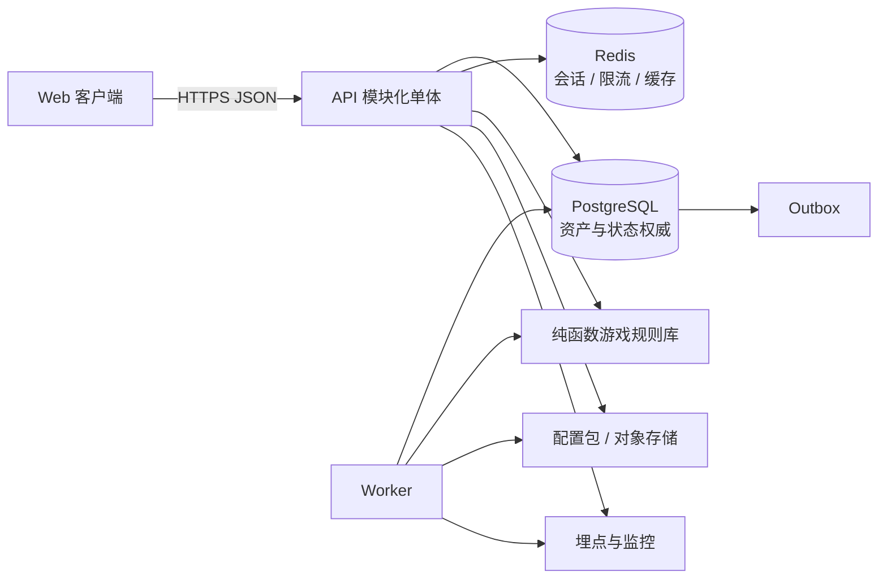

# 《洞天》技术架构与服务端权威方案 V1.0

## 1. 架构目标

优先保障确定性结算、资产安全、配置可追溯和小团队交付速度。MVP 不采用微服务；使用模块化单体加独立 Worker，保持未来拆分边界。

## 2. 推荐技术基线

在没有新的技术约束时，默认采用以下具体基线；更换框架需要 ADR，但不得降低事务与可测试性保证：

| 层 | 推荐基线 | 理由 |
|---|---|---|
| 客户端 | TypeScript + React + Vite | PC / Web 快速迭代，适合数据密集 UI |
| 服务端 API | TypeScript + NestJS（Fastify Adapter） | 与客户端共享类型，模块和测试边界清晰 |
| 数据库 | PostgreSQL | 事务、约束、JSONB、审计能力成熟 |
| 缓存 / 短锁 | Redis，可在早期本地开发中关闭 | 会话、限流、短期缓存；不作为资产权威 |
| Worker | 与 API 同仓同语言的独立进程 | 配置发布、后台续算、埋点 Outbox、补偿任务 |
| 对象存储 | S3 兼容 | 配置包、静态资源、日志导出 |
| 监控 | OpenTelemetry + 指标 / 日志 / Trace 后端 | 统一关联请求、事务和结算 |
| 部署 | 容器化；测试、预发布、生产独立环境 | 可重复、可回滚 |

采用 monorepo：`apps/web`、`apps/api`、`apps/worker`、`packages/contracts`、`packages/game-rules`、`packages/config-schema`、`packages/ui`。

## 3. 总体结构



客户端永远不直接连接数据库、Redis 或配置私有存储。

## 4. 服务端模块

| 模块 | 职责 | 不负责 |
|---|---|---|
| Auth / Account | 登录、会话、角色归属 | 游戏资产计算 |
| Character | 角色概要、境界、状态版本 | 自行重算离线收益 |
| Settlement | 统一推进时间、行动快照、摘要 | UI 展示逻辑 |
| Queue | 校验、保存、重排队列 | 资产结算 |
| Inventory / Ledger | 资产余额、装备实例、双边账本 | 掉率决定 |
| Progression | 修为、百艺 XP、境界、突破 | 配置编辑 |
| Combat | 普通战斗模拟、策略、结果 | 客户端动画 |
| Dungeon | 机会、运行状态机、路线、奖励 | 闭关队列槽位 |
| Market（预留） | 保留模块名、`feature.market` 与未来 `/api/v1/market` 命名空间 | MVP 不注册 Controller / Service，不建表，不实现任何买卖 |
| Cave | 设施建造与永久修正 | 百艺配方本身 |
| Config | 配置加载、校验、灰度、快照 | 随意覆写历史版本 |
| Tutorial / Goals | 教程和目标状态 | 权威资产奖励之外的本地发奖 |
| Admin | 只读查询、补偿申请、配置状态 | 直接改数据库余额 |

## 5. 纯函数规则库

`packages/game-rules` 不访问网络、数据库或系统时间。输入全部显式：角色快照、配置、开始 / 结束时间、随机种子；输出为状态变化提案和账本分录提案。

至少包含：

- 修正合并与软上限。
- 行动周期计算与批量结算。
- XP / 境界阶段映射。
- 战力与战斗模拟。
- 秘境成功、节点和掉落计算。
- 非市场 Faucet / Sink 与资源可达性检查；市场公式留到专项立项。
- 突破条件检查。

同一输入必须得到字节级等价结果。规则库的黄金测试由数值母表关键样例生成。

## 6. 请求与事务流程

关键写操作统一采用：

```text
鉴权
→ 限流
→ 校验幂等键
→ 开数据库事务
→ 锁定 character / settlement_state
→ 先结算到 server_now
→ 校验业务前置
→ 写状态 + 资产账本 + 领域事件 Outbox
→ 更新 state_version
→ 提交事务
→ 返回稳定响应
```

不能在数据库提交后再依赖一个必须成功的同步外部调用；分析、通知和非关键缓存通过 Outbox 异步完成。

## 7. 并发控制

- 单角色关键写操作以数据库行锁串行化。
- 客户端队列、装备预设等编辑同时使用 `state_version` / `queue_version` 乐观锁，提供友好冲突提示。
- MVP 没有跨角色资产操作；未来市场必须另行评审多角色事务与反作弊。
- Redis 锁不能替代数据库事务；锁丢失也不能破坏资产不变量。
- Worker 领取任务使用 `FOR UPDATE SKIP LOCKED` 或等价机制，保证最多一个执行者提交。

## 8. 不运行持续角色计时器

服务器不为每个离线玩家维持 Timer。角色状态只保存最后结算时间和行动进度，在读取或写入前按时间差推进。

收益：

- 离线玩家几乎不消耗持续计算资源。
- 重启不丢进度。
- 易于通过快照和时间区间重放。

后台 Worker 只处理分段上限、配置迁移和已到期但必须主动完成的少数系统任务。

## 9. 缓存策略

- 配置包：进程内只读缓存，以版本键控；旧版本保留到无运行快照引用。
- 角色资产：数据库权威，不在 Redis 中独立写回。
- 首页读模型：可短缓存，但响应必须带 `state_version` 和 `as_of`；任何写后失效。
- 未来市场：MVP 不缓存、不生成价格，只保留功能开关与命名空间。

## 10. 认证与权限

- MVP 支持正式账号和受控匿名测试账号；匿名账号升级时事务迁移角色归属。
- 浏览器会话使用 HttpOnly、Secure、SameSite=Lax Cookie；所有状态写请求同时校验 Origin 和 CSRF Token。原生客户端若后续加入，再单独采用短期访问令牌。
- 管理端与玩家端权限完全分离，管理员使用 MFA。
- 管理员补偿采用申请 → 审批 → 执行，至少保留操作者、原因和关联事故。

## 11. 反作弊与滥用

- 不信任客户端时间、库存、掉落、战斗结果、成功率或解锁状态。
- 对队列保存、淬炼、秘境进入、突破设置速率限制和行为异常检测。
- 检测不可能的资产增速、负余额尝试、重复幂等键和旧客户端重放。
- 所有配置响应可公开展示需要的部分，但隐藏随机种子和风控阈值。
- 任何市场开发开始前必须另做反小号、转移价值、价格操纵、机器人、撮合与交易审计方案评审。

## 12. 可观测性

每个请求关联：`trace_id`、`account_id`（脱敏）、`character_id`、`transaction_id`、`settlement_id`、`config_version`。

关键指标：

- API 延迟、错误率、数据库锁等待、事务重试。
- 每次结算分段数、结算时间、封顶时长、阻塞原因。
- 幂等命中和键冲突。
- 负库存约束失败、账本核对差异。
- 秘境运行卡死、超时自动选择、重复结算防护。
- 配置版本分布、回滚次数、规则异常。

结构化日志不得记录密码、完整会话令牌或不必要的个人信息。

## 13. 备份与灾难恢复

- PostgreSQL 每日全量备份和持续 WAL / 等价增量备份。
- 生产目标：RPO ≤ 15 分钟，RTO ≤ 2 小时；公开发行前再次评审。
- 每月至少演练一次恢复到隔离环境并执行账本核对。
- 配置包与静态资源使用版本化存储，不覆盖原对象。
- 灾难恢复后，按事务 ID 去重 Outbox 和补偿任务。

## 14. 环境与发布

```text
local → test → staging → production
```

- 每个环境使用独立数据库、对象存储前缀、密钥和分析项目。
- 数据库迁移先向后兼容：先加后用，最后删除。
- 服务端支持当前与上一客户端协议版本；破坏性变更提升 API 主版本。
- 配置与代码可独立发布，但配置声明最小客户端和公式版本。
- 灰度以账号稳定哈希分桶；资产公式实验不得造成不可解释的长期进度差异。

## 15. CI/CD 门禁

- 格式、静态检查、类型检查、单元测试。
- 数据库迁移在空库和上一版本快照上演练。
- 配置 Schema、引用、套利、可达性和黄金角色重放校验。
- API 契约兼容检查。
- 端到端垂直切片冒烟。
- 镜像漏洞与密钥扫描。
- 部署后自动健康检查；失败自动停止灰度并回滚。

## 16. 容量基线

MVP 架构先按以下可测目标设计，不提前微服务化：

- 10,000 注册测试账号。
- 1,000 日活、200 峰值并发会话。
- 峰值 50 个权威写请求 / 秒。
- 单次正常离线结算少于 100 个分段。

压测达到目标两倍且数据库 CPU、锁等待和 P95 仍有余量后方可公开扩大测试。

## 17. 架构决策

- ADR-001：MVP 使用模块化单体，不使用微服务。
- ADR-002：PostgreSQL 与资产账本为权威，Redis 不是权威数据源。
- ADR-003：惰性结算，不为离线角色常驻 Timer。
- ADR-004：规则库纯函数化，客户端只做预测显示。
- ADR-005：已被 ADR-007 取代，不再开发 MVP 模拟市场。
- ADR-006：所有关键写操作先结算再变更，并要求幂等键。
- ADR-007：市场整体延后；MVP 只保留功能 ID、模块名和未来 API 命名空间，所有关键资源必须有非市场来源。

这些默认决策足以开始垂直切片；若更换技术栈，必须保留同等事务、确定性和可审计保证。
