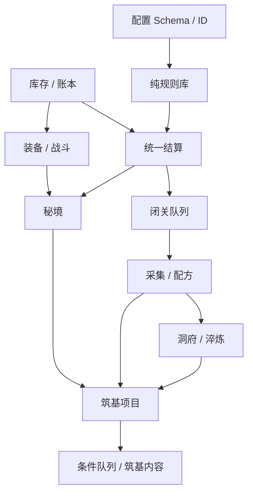

# 《洞天》开发拆解、里程碑与垂直切片 V1.0

## 1. 制作策略

先做一条真实、可保存、可重连、可审计的纵向链路，再扩充系统和内容。禁止先制作大量页面壳或静态数值演示，再补服务端结算。

首个垂直切片完成定义：

> 新账号登录，完成修炼和采药教学，安排闭关，模拟离线后正确结算，配置并完成一次青蛇洞秘境，处理战利品，再次安排闭关；中途刷新和重复请求不会重复资产。

## 2. 团队与节奏假设

建议小团队基线：产品 / 系统策划 1、技术负责人 / 服务端 1、客户端 1～2、UI/UX 1、美术 1、QA 1；成员可兼任。以两周 Sprint 为例，完整 MVP 约 8 个 Sprint 的计划基线，但最终日期需按实际人力估算。

所有工单包含：用户价值、前置、接口 / 数据、验收、测试、埋点、资产依赖和文档链接。

## 3. 里程碑总览

| 里程碑 | 建议阶段 | 可交付结果 | 出口条件 |
|---|---|---|---|
| M0 工程地基 | Sprint 0 | 仓库、环境、CI、Schema、配置流水线 | 可部署空壳且迁移 / 回滚通过 |
| M1 时间内核 | Sprint 1 | 角色、资产、修炼、单项行动、统一结算 | 在线 / 离线黄金测试一致 |
| M2 闭关垂直切片 | Sprint 2 | 队列、摘要、采药、炼丹、首页 | 8 小时回流链路可用 |
| M3 在线秘境切片 | Sprint 3 | 装备、战斗、青蛇洞、断线恢复 | 完整垂直切片通过 |
| M4 生产成长 | Sprint 4 | 挖矿、炼器、工具、战利品整理 | 非市场资源闭环成立 |
| M5 筑基 Endgame | Sprint 5 | 淬炼、洞府、筑基项目、条件队列 | 新账号加速可完成筑基 |
| M6 内容与体验 | Sprint 6 | 内容扩量、教程、UI 完整状态、音画 | P0 内容下限达成 |
| M7 稳定与封闭 Alpha | Sprint 7 | 压测、安全、数据面板、恢复演练 | 发布门禁全部通过 |

## 4. M0：工程地基

### EPIC-000 仓库与工程规范

- Monorepo、包边界、代码所有权。
- 格式、类型、单元测试、提交检查。
- 环境变量 Schema、密钥管理、日志脱敏。
- 本地一键启动 API、Web、数据库和 Worker。

### EPIC-010 数据库与迁移

- 账号、角色、库存、装备、账本、幂等、Outbox 基础表。
- 迁移在空库和上一快照上演练。
- 种子数据与测试重置工具。

### EPIC-020 配置流水线

- JSON Schema、稳定 ID 校验、引用校验。
- 首批 realm / item / action / recipe 配置。
- 配置包签名 / 哈希、加载、版本和回滚。
- Numerical Master Sheet 导出映射先以可重复脚本或规范 CSV 实现。

### EPIC-030 可观测性

- request / transaction / settlement trace。
- 错误、延迟、数据库、账本指标。
- 测试环境最小仪表盘。

出口：部署测试环境，健康检查通过；配置错引用会阻断发布；数据库可回滚或前向修复。

## 5. M1：时间内核

### EPIC-100 角色与进度

- 角色创建、境界、修为、百艺进度。
- 服务端功能权限和状态版本。

### EPIC-110 资产与账本

- 堆叠库存、装备实例、灵石。
- 原子资产服务和不可变账本。
- 余额核对命令与测试。

### EPIC-120 纯规则库

- 修正、周期、XP、随机种子、舍入。
- 黄金样例：百草谷、聚气散、基础修炼。

### EPIC-130 统一结算 V1

- 单行动惰性推进、离线 10 小时封顶。
- 快照、配置版本、结算摘要。
- 幂等、崩溃注入、后台分段保护。

出口：同一 10 小时时间段的在线逐周期、离线批量和崩溃恢复结果一致。

## 6. M2：闭关与生产垂直切片

### EPIC-200 队列

- 1 / 2 槽、固定数量 / 时长、无限保底。
- 预览、保存、队列版本冲突。
- 材料不足、跳过、保底和摘要原因。

### EPIC-210 首页与结算摘要

- 洞府首页布局、当前行动、目标追踪占位。
- 离线时间轴、获得 / 消耗、稀有和异常。

### EPIC-220 采药与炼丹

- 百草谷、雾隐坡首批行动。
- 聚气散、聚气丹、回春丹首批配方。
- 百艺列表、配方、来源跳转、加入队列。

### EPIC-230 丹药 Buff

- 1 槽、使用、到期、行动快照生效边界。

出口：玩家能安排“采药 → 炼丹 → 无限修炼”，模拟 8 小时后得到正确且可解释结果。

## 7. M3：在线秘境垂直切片

### EPIC-300 装备与预设

- 武器、防具、饰品、属性、预设。
- 粗制剑、布衣、青玉佩种子内容。

### EPIC-310 自动战斗

- 服务端战斗模拟、固定种子、基础策略。
- 青蛇普通战斗与战斗结果。

### EPIC-320 秘境机会

- 12 小时恢复、上限 6、教学赠送。
- 权威机会账本与下次恢复显示。

### EPIC-330 青蛇洞

- 准备、推荐战力、入场事务、节点、一次路线选择。
- 断线恢复、超时安全路线、结果页。
- 闭关并发继续。

出口：完整垂直切片可在无调试直接改资产的条件下完成；入场 / 结果重复请求安全。

## 8. M4：生产、工具与战利品整理

### EPIC-400 挖矿与炼器

- 赤铜、玄铁、星纹钢、灵玉梯度。
- 工具、丹炉、剑、防具配方。
- 工具装备只影响新周期。

### EPIC-410 战利品整理与资源可达性

- 装备比较、装备、保留和用途跳转。
- 材料的采集、配方、战斗、秘境、洞府、淬炼与突破用途。
- 自动校验全部关键材料都有非市场来源。

### EPIC-420 高级数据渐进展示

- 炼气简化数据；筑基深度信息开关。
- 每小时价值 / 成本解释，默认不压迫新手。

出口：玩家可完成“采集材料 → 自制工具 → 秘境获取稀有材料 → 制作 / 装备 → 整理重复战利品”的完整选择；突破和关键配方不依赖市场。

## 9. M5：筑基 Endgame

### EPIC-500 淬炼

- +1～+6、概率、消耗、保护字段预留。
- 结果审计与装备实例更新。

### EPIC-510 洞府

- 聚灵室、炼丹房、炼器房。
- 开建、离线完成、下周期生效。

### EPIC-520 筑基项目与试炼

- 修为、丹药、灵髓、护脉丹、灵石 / 资产覆盖。
- 缺口来源、预计完成、15 分钟试炼、100% 成功。
- 原子扣除和解锁包。

### EPIC-530 筑基解锁

- 3 槽、库存条件队列、3 药力槽、二阶行动。
- 黑风秘境和筑基内容入口。

出口：黄金角色与加速新账号均能完成筑基；重复提交、跨设备和热更边界通过。

## 10. M6：内容与体验

- 补齐 6 普通区域、8～12 妖兽、2～3 Boss、2+ 秘境。
- 丹药、装备、工具、洞府等级达到内容下限。
- 完成 10 条教程和目标追踪。
- 全页面空 / 加载 / 失败 / 锁定 / 维护状态。
- 正式资源 Icon、核心装备、区域背景、基础战斗 / 获得 / 突破音效。
- 1024～2560 分辨率和键盘流程验收。
- 首轮 5～8 人可用性测试并修正。

出口：内容清单 P0 全部达到“实现 + 配置 + 表现 + 测试”完成，不以占位文案冒充正式内容。

## 11. M7：稳定与 Alpha

- 200 并发登录结算和 50 写请求 / 秒压测。
- 安全测试、越权、重放、参数篡改。
- 备份恢复与配置回滚演练。
- 核心数据、经济、资产一致性面板和告警。
- 生产运行手册、事故分级和补偿流程。
- 清零 S0 / S1，逐项批准 S2。

出口：发布门禁通过后小规模白名单 Alpha，不直接大规模开放。

## 12. 依赖关系



关键路径：配置 / 规则 → 资产 / 结算 → 队列 → 生产 → 装备战斗 → 秘境 → 筑基。

## 13. 横切工单

每个 Epic 同时拆分：

- 后端规则与数据库。
- OpenAPI 与生成类型。
- 客户端正常 / 空 / 加载 / 错误 / 锁定状态。
- 配置和内容。
- 单元、集成、E2E。
- 埋点与监控。
- 文案、美术、音效。
- 文档和版本记录。

禁止创建“最后统一补测试 / 埋点 / 错误态”的尾部垃圾桶 Sprint。

## 14. 工单模板

```text
标题：<EPIC>-<序号> 用户可感知结果
用户故事：
范围：
非范围：
前置与依赖：
数据 / 配置：
API：
UI 状态：正常 / 空 / 加载 / 错误 / 锁定
不变量与边界：
验收条件：Given / When / Then
自动化测试：
埋点 / 监控：
资产与文案：
文档影响：
```

## 15. 变更控制

- Sprint 内新增需求必须指出替换掉的同等工作量；不能默认只加不减。
- P0 范围变化由产品、技术、QA 三方确认并更新 PRD。
- 影响资产公式的变更必须经过数值母表、黄金重放和配置差异。
- MVP 完成前不开发模拟市场、NPC 买卖、真实市场、宗门、法修或移动端适配；市场只保留扩展边界。
- 若核心结算或账本未稳定，停止内容扩量，优先修复基础。

## 16. 每周演示要求

演示使用部署环境和普通测试账号，不直接改数据库或使用只为演示存在的脚本。必须展示一次失败 / 重试 / 断线场景，以及对应日志或账本证据。
