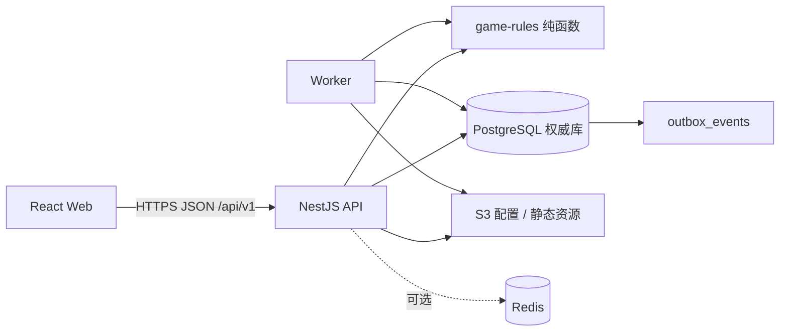

# 《洞天》Luna 代码开发实施规格 V1.0

**项目：** 修仙 Idle MMO（暂定名《洞天》）  
**用途：** 直接交给 Luna 按任务编号编写代码  
**基线日期：** 2026-08-16  
**开发范围：** PC / Web MVP；凡人、炼气、筑基  
**状态：** 已锁定，可开始 M0 工程地基与首个垂直切片

---

## 0. 如何使用本文档

本文不是方向建议，而是实现约束。执行代码任务的模型必须遵守以下规则：

1. 每次只实施本文第 21 节中的一个任务编号，不顺手开发后续任务。
2. 不改变技术栈、目录、数据库权威、API 路径、响应结构或事务顺序。
3. 遇到未定义的小型实现细节，使用本文的“默认实现”；不得引入第二套框架。
4. 遇到会影响资产、时间、随机、掉落、突破、未来市场扩展边界或兼容性的缺口，停止并报告，不自行创造规则。
5. 客户端只负责展示和预测，不能决定时间、余额、掉落、成功率、解锁或最终结果。
6. 所有权威写操作必须先结算、再校验、再变更，并与账本和 Outbox 同事务提交。
7. 每个任务必须同时提交实现、测试、迁移或配置、错误处理和必要文档，禁止先留 TODO。
8. 禁止使用演示脚本直接改数据库资产来伪造完成链路。
9. 禁止删除或改写用户已有文件；修改前先检查工作区差异。
10. 一个任务完成时必须报告：修改文件、执行命令、测试结果、已知限制、下一任务编号。

### 0.1 规则权威顺序

冲突时按以下顺序执行：

1. 最新批准的 ADR / 决策记录。
2. [MVP PRD 与验收标准](./02_MVP_PRD与验收标准_V1.0.md)。
3. [闭关、离线结算与秘境规则](./03_闭关离线结算与秘境规则规格_V1.0.md)。
4. [数据模型、配置表与 ID 规范](./04_数据模型配置表与ID规范_V1.0.md)。
5. 本实施规格、[API 契约](./06_API契约状态码与幂等规范_V1.0.md)和[测试计划](./08_测试计划与质量门禁_V1.0.md)。
6. [Numerical Master Sheet V0.1](../../outputs/2026-08-15_numerical-master-sheet-v0.1/Numerical_Master_Sheet_V0.1.xlsx)中的数值与公式。
7. [核心 GDD V0.1](../修仙_Idle_MMO_核心游戏设计_GDD_V0.1.md)的设计意图。

如果本文与第 2～4 项冲突，以第 2～4 项为准并提交文档修正，不允许只在代码中改变口径。

---

## 1. 产品实现目标

MVP 只需证明以下闭环成立：

```text
登录 / 回流
→ 服务端结算最多 10 小时离线进度
→ 玩家理解获得、消耗、行动切换和阻塞原因
→ 玩家重新安排未来 8～12 小时
→ 闭关持续推进
→ 玩家上线时配置装备与丹药进入秘境
→ 服务端自动战斗并提供路线选择
→ 玩家获得高级材料或装备
→ 玩家选择装备、保留、用于生产或淬炼
→ 再次调整闭关计划
```

必须支持 3～5 分钟快速回流，也必须支持约 25 分钟的正常在线游玩。秘境不是闭关的替代品，秘境运行期间闭关继续推进。

### 1.1 MVP 范围

- 境界：凡人、炼气四阶段、筑基四阶段数据；筑基是 MVP Endgame。
- 百艺：采药、挖矿、炼丹、炼器、淬炼。
- 队列：凡人 1 槽、炼气 2 槽、筑基 3 槽；独立无限保底。
- 行动模式：固定次数、固定时长、无限执行；筑基增加单库存条件。
- 战斗：剑修、服务端自动战斗、装备 / 丹药 / 策略预设。
- 秘境：至少青蛇洞、玄铁秘窟；至少一次安全 / 高风险路线选择。
- 经济：只实现系统 Faucet / Sink 与资产账本；市场、坊市、NPC 买卖全部延后。
- 洞府：聚灵室、炼丹房、炼器房。
- 突破：筑基多门槛项目、15 分钟试炼、准备充分后 100% 成功。
- 平台：桌面 Web，目标宽度 1024～2560。

### 1.2 明确禁止加入

- 微服务、Kubernetes、事件溯源全量重建、CQRS 双数据库。
- Unity / Godot 客户端、实时开放世界、实时组队或 PVP。
- GraphQL、tRPC、客户端直连数据库、Firebase 式客户端权威。
- 任何市场 / 坊市 / NPC 买卖 / 报价 / 交易撮合、宗门、聊天、法修 / 体修完整流派、金丹可玩内容。
- 每日任务红点、固定时刻活动、离线收益付费翻倍。
- 抽卡角色、售卖数值资源、自动采购脚本。

---

## 2. 锁定技术栈

版本基线记录于 2026-08-16。初始化时必须生成并提交 `pnpm-lock.yaml`，后续 CI 使用 frozen lockfile；不得在同一任务中无关升级依赖。

| 层 | 锁定方案 | 版本策略 |
|---|---|---|
| Runtime | Node.js 24 LTS | `.nvmrc` 与 `package.json#engines` 固定 24.x |
| 语言 | TypeScript | 7.x，所有包 `strict=true` |
| 包管理 | pnpm workspace | 11.x |
| 前端 | React + Vite | React 19.x、Vite 8.x |
| 路由 | React Router | 8.x |
| 服务端状态 | TanStack Query | 5.x |
| 本地 UI 状态 | Zustand | 5.x，只存 UI 草稿 |
| 表单 | React Hook Form + Zod | Zod 4.x |
| 样式 | Tailwind CSS + Radix UI | Tailwind 4.x |
| API | NestJS + Fastify Adapter | NestJS 11.x、Fastify 5.x |
| API 文档 | `@nestjs/swagger` | OpenAPI 3.1 输出 |
| 数据库 | PostgreSQL | 固定 PostgreSQL 18 主版本 |
| ORM | Prisma ORM | 7.x |
| 核心 SQL | Prisma TypedSQL / 参数化 raw SQL | 只放 repository 层 |
| 精确计算 | `decimal.js` | 规则库统一封装 |
| 配置校验 | Zod | 与运行时配置类型共源 |
| 日志 | Pino | JSON 结构化日志 |
| 追踪 | OpenTelemetry | API、数据库、Worker |
| 单元 / 集成测试 | Vitest + Testcontainers | Vitest 4.x |
| 浏览器 E2E | Playwright | 1.x，Chromium 为门禁 |
| 本地基础设施 | Docker Compose | PostgreSQL 必需，Redis 可选 |

### 2.1 技术栈默认决定

- 不使用 Next.js：本项目 MVP 不需要 SSR、SEO 或 Server Components。
- 不使用 GraphQL / tRPC：使用 REST + OpenAPI，便于未来桌面壳、移动端和管理端复用。
- 不让 Prisma 隐藏核心锁：结算、资产消耗、突破、秘境发奖必须使用显式事务和可审查 SQL。
- Redis 默认关闭：M0～M3 不得依赖 Redis 才能保证资产正确。
- WebSocket 不作为正确性依赖；必要时仅用 SSE 提醒客户端重新 GET 权威状态。

### 2.2 依赖归属

初始化时按下表安装，不允许同一职责出现两个库：

| 位置 | 依赖 |
|---|---|
| 根开发依赖 | `typescript`、`eslint`、`prettier`、`vitest`、`tsx` |
| `apps/web` | `react`、`react-dom`、`react-router`、`@tanstack/react-query`、`zustand`、`react-hook-form`、`zod`、`tailwindcss`、所需 Radix 单组件包 |
| `apps/api` | `@nestjs/common`、`@nestjs/core`、`@nestjs/platform-fastify`、`@nestjs/swagger`、`fastify`、`@fastify/cookie`、`@fastify/helmet`、`argon2`、`nestjs-pino` |
| `apps/worker` | NestJS application context、Pino、OpenTelemetry；不加载 HTTP Adapter |
| `packages/database` | `prisma`、`@prisma/client`、`@prisma/adapter-pg`、`pg` |
| `packages/game-rules` | `decimal.js`；固定随机算法在包内实现并以黄金测试锁定，不再引入第二个随机库 |
| `packages/config-schema` | `zod` |
| 集成测试 | `testcontainers`、真实 PostgreSQL；HTTP 使用 Fastify inject |
| E2E | `@playwright/test` |

认证会话使用本项目 `sessions` 表，不引入 Passport、第三方托管身份或通用 Session ORM。CSRF 使用“双重校验”：服务端会话保存 token 哈希，`GET /auth/session` 返回当前 token，写请求通过 `X-CSRF-Token` 提交并同时校验 `Origin`。密码只使用 `argon2` 的 Argon2id 模式。

Prisma 7 使用显式生成目录和 PostgreSQL Driver Adapter；`PrismaClient` 只能在 `packages/database` 的单例 provider 中创建。任何其他包不得直接 new 客户端。

---

## 3. 仓库结构

仓库必须使用以下结构，不新增同职责平行目录：

```text
/
├─ apps/
│  ├─ web/                    # 玩家 Web 客户端
│  ├─ api/                    # NestJS 模块化单体
│  ├─ worker/                 # Outbox、续算、配置任务
│  └─ admin/                  # M6 前只保留包入口，不开发完整 UI
├─ packages/
│  ├─ contracts/              # OpenAPI 生成的客户端类型、错误码
│  ├─ game-rules/             # 无 I/O 的确定性纯函数
│  ├─ config-schema/          # Zod Schema、配置类型、校验器
│  ├─ database/               # Prisma Schema、迁移、repository
│  ├─ observability/          # 日志、trace、metrics 共用初始化
│  ├─ test-fixtures/          # 黄金角色、固定配置、测试构造器
│  └─ ui/                     # 通用 UI 组件和设计 token
├─ config/
│  ├─ source/                 # 人工维护 / 工作簿导出的规范中间数据
│  ├─ releases/               # 不可变配置包；开发环境可保留一份 seed
│  └─ schemas/                # 导出的 JSON Schema
├─ tooling/
│  ├─ config-export/          # 数值表 → 配置包
│  ├─ config-validate/        # 引用、套利、可达性、黄金重放
│  └─ db-audit/               # 账本核对、健康检查
├─ tests/
│  ├─ e2e/
│  ├─ performance/
│  └─ security/
├─ docs/
├─ docker-compose.yml
├─ pnpm-workspace.yaml
├─ tsconfig.base.json
├─ eslint.config.js
├─ package.json
└─ pnpm-lock.yaml
```

### 3.1 包依赖方向

允许：

```text
config-schema ← game-rules
config-schema ← database
game-rules    ← api / worker
database      ← api / worker
contracts     ← web
ui            ← web / admin
observability ← api / worker
```

禁止：

- `game-rules` 引用 NestJS、Prisma、浏览器 API、系统时间、网络或文件系统。
- `database` 引用 API Controller 或前端代码。
- `web` 引用 Prisma、数据库 Schema 或服务端私有随机字段。
- 模块之间直接访问对方 Prisma 表；跨模块必须调用公开 Application Service。

### 3.2 TypeScript 规则

- `strict`、`noUncheckedIndexedAccess`、`exactOptionalPropertyTypes`、`noImplicitOverride` 开启。
- 禁止业务代码中的裸 `any`、非空断言滥用和静默 `catch`。
- 所有跨包导入通过包公开 `index.ts`，禁止深入引用内部路径。
- 文件名使用 `kebab-case`；类型 / 类使用 `PascalCase`；函数 / 字段使用 `camelCase`；数据库使用 `snake_case`。
- API DTO 不复用 Prisma Model；必须经过映射层，避免泄漏私有字段。

---

## 4. 运行时组件与职责



### 4.1 API 进程

负责鉴权、DTO 校验、幂等、数据库事务、模块编排和稳定响应。API 不执行长时间外部调用；分析和通知进入 Outbox。

### 4.2 Worker 进程

MVP 只负责：

- 消费 `outbox_events` 并幂等投递分析事件。
- 继续处理超过结算分段上限的角色。
- 配置包校验、发布和回滚任务。
- 洞府 / 试炼等到期恢复扫描，但权威完成仍使用同一服务函数。
- 账本对账和异常告警。

Worker 不为每个玩家创建常驻计时器，不依赖精确到秒的队列任务才能保证收益。

### 4.3 PostgreSQL

唯一权威：角色状态、资产、预留、队列、结算进度、秘境、突破、幂等和账本。

### 4.4 Redis

后续只用于限流、短期缓存、在线状态或非关键通知。Redis 数据丢失不得导致余额变化、重复发奖或队列丢失。

---

## 5. 服务端模块边界

每个模块统一包含：`domain/`、`application/`、`infrastructure/`、`presentation/`。简单模块可以合并文件，但不得混淆职责。

| 模块 | 公开能力 | 严禁承担 |
|---|---|---|
| Auth | 匿名账号、注册、登录、会话、升级 | 游戏资产计算 |
| Character | 角色归属、概要、状态版本 | 独立计算离线收益 |
| Config | 加载、按版本读取、公开 Manifest | 改写旧配置包 |
| Inventory | 查询余额、预留、扣除、增加、装备实例 | 决定掉率 |
| Ledger | 在业务事务中追加不可变分录、核对 | 覆盖余额 |
| Progression | 修为、技能 XP、阶段映射、解锁 | 客户端展示逻辑 |
| Settlement | 惰性推进、快照、摘要、检查点 | 未来扩展系统逻辑 |
| Queue | 预览、保存、版本、阻塞策略 | 直接发放资产 |
| Buff | 丹药槽、到期、快照修正 | 修改已开始周期 |
| Equipment | 装备实例、预设、换装、淬炼 | 客户端决定成功 |
| Combat | 固定种子战斗模拟 | 播放动画 |
| Dungeon | 机会、入场、节点、路线、结算、恢复 | 占用闭关槽位 |
| Market（预留） | 只保留模块命名、功能开关和未来端点命名 | MVP 中不得实现页面、报价、买卖、数据库表或资产入口 |
| Cave | 设施建造和永久修正 | 单独实现生产公式 |
| Breakthrough | 条件、预留、试炼、原子升级 | 准备充分后的随机失败 |
| Tutorial / Goals | 服务端可验证进度和幂等奖励 | 信任客户端完成关键步骤 |
| Admin | 只读诊断、补偿申请 / 审批 | 任意 SQL、直接改余额 |

### 5.1 模块调用规则

- Controller 只做请求上下文、DTO 与响应映射。
- Application Service 编排事务，不包含公式细节。
- Domain / `game-rules` 计算提案，不直接写库。
- Repository 只负责数据和锁，不产生业务决定。
- 所有资产变更经 `AssetMutationService`，由调用者提供 `reasonCode`、`reference`、`configVersion`。
- Controller 禁止直接注入 Prisma Client。

---

## 6. 精度、时间、ID 与随机

### 6.1 时间

- 数据库存绝对时间：`timestamptz(3)`，统一 UTC。
- 规则库持续时间：`bigint` 微秒。
- API 时间：ISO 8601 UTC 字符串。
- 客户端时间只能用于倒计时动画，任何请求中的 `now` 不参与结算。
- 结算时间由 API 在事务开始后读取数据库时间或可信服务端时间一次，并作为显式参数传入规则库。
- 基础离线上限：`36_000` 秒。

### 6.2 数值

- 物品、机会、装备数量：数据库 `bigint`；TypeScript 使用 `bigint`；JSON 使用十进制字符串。
- 修为、XP、价格、倍率：数据库 `numeric(30,6)`；规则库使用 `Decimal`；JSON 使用十进制字符串。
- 角色等级、队列槽、枚举序号：32 位整数。
- 禁止用 JavaScript `number` 累加资产、XP、价格或微秒时间。
- 舍入策略由配置指定；默认产出和扣除向下取整，显示格式不改变存储值。

### 6.3 ID

- 业务配置 ID：`domain.tier.slug`，发布后永不复用。
- 运行实例、事务、账本、队列项、幂等键：UUIDv7。
- PostgreSQL 主键使用 `uuid`；业务表同时保存稳定配置 ID。
- 所有对外资源查询同时校验账号 / 角色归属，不以“猜不到 UUID”代替权限控制。

### 6.4 确定性随机

- 每个 `settlement_run`、`dungeon_run`、`temper_attempt` 创建 128 位服务端随机种子并持久化；不返回客户端。
- 派生输入：`seed + namespace + cycleIndex/nodeId/attemptIndex + lootTableVersion`。
- 初始化方式：SHA-256 派生 4 个 `uint32`；PRNG 算法固定为 `xoshiro128**`，算法编号写入 `formula_version`。
- 相同运行重试必须复用已保存种子；不能再次调用系统随机。
- 黄金测试固定种子并比较完整输出。

---

## 7. 配置系统

### 7.1 不可变配置包

```text
config/releases/<config_version>/
  manifest.json
  realms.json
  feature_unlocks.json
  skills.json
  xp_curves.json
  items.json
  actions.json
  recipes.json
  tools.json
  equipment.json
  buffs.json
  monsters.json
  dungeons.json
  loot_tables.json
  breakthroughs.json
  cave_facilities.json
  tempering.json
  future/market.example.json     # 仅扩展字段草案，不进入 active manifest
  tutorials.json
  goals.json
  localization/zh-CN.json
```

`manifest.json` 必须含：`config_version`、`schema_version`、`formula_version`、`created_at`、`min_client_version`、`content_hash`、`previous_version`。

### 7.2 加载规则

1. 进程启动读取 active release 指针。
2. 校验 Manifest、SHA-256、Zod Schema、所有引用和业务检查。
3. 成功后构建只读 `ConfigRegistry`，按版本和 ID 查询。
4. 旧版本只要仍被周期 / 秘境 /突破快照引用就必须保留。
5. 禁用内容不能新启动，但历史运行按旧快照完成。
6. 配置错误必须阻止进程 readiness 或阻止发布，不能忽略并使用部分配置。

### 7.3 工作簿导出

Numerical Master Sheet 不是运行时依赖。工具按固定流程执行：

```text
工作簿输入与公式结果
→ 规范 CSV / JSON 中间表
→ Zod / JSON Schema
→ ID 与引用
→ 概率、梯度、秘境图、突破可达性
→ 套利扫描
→ 黄金角色新旧版本影子结算
→ 差异报告
→ 人工批准
→ 不可变配置包
```

第一阶段可人工维护 `config/source/*.json` 作为已审核导出结果，但禁止把运行数值散落在 TypeScript 常量中。

### 7.4 必需系统行动：基础无限修炼

`action.cultivation.qi` 是 M0 配置 Registry、M1 单行动结算和所有队列保底的前置，不得缺省或由代码临时构造。

锁定配置：

| 字段 | 值 |
|---|---|
| ID | `action.cultivation.qi` |
| 显示名 | 吐纳修炼 |
| 最低境界 | `realm.mortal.entry`，新角色立即可用，无最高境界限制 |
| 基础周期 | 60 秒，即 `60_000_000` 微秒 |
| 每周期修为 | `4.500000` |
| 基础小时修为 | `270.000000` |
| 物品输入 / 输出 | 空 / 空 |
| 百艺与百艺 XP | `skill_id=null`、`skill_xp=0` |
| 随机掉落 | 无，`loot_table_id=null` |
| 队列模式 | `DURATION`、`INFINITE` |
| 工具要求 | 无 |
| 修正标签 | `cultivation` |
| 默认角色行为 | `action_queues.fallback_action_id` 的初始值 |

通用 `cultivation` Buff、聚灵室和全局修炼修正按标准修正管线作用，但此行动没有内置加成。修正在每个 60 秒周期开始时进入快照，当前周期中途变化只影响下一周期。境界提升不自动改变本行动基础值；更高阶修炼法以后以新 action ID 扩展。

结算时聚合写入修为进度和审计分录：`asset_type=PROGRESSION`、`asset_id=progression.cultivation`、`reason_code=ACTION_CULTIVATION`。不为每个周期单独写事务，使用 settlement segment 聚合完整周期数。

黄金结果（无任何修正）：

| 有效时间 | 完整周期 | 修为 | 尾部进度 |
|---:|---:|---:|---:|
| 0 微秒 | 0 | 0 | 0 |
| 59,999,999 微秒 | 0 | 0 | 59,999,999 微秒 |
| 60,000,000 微秒 | 1 | 4.5 | 0 |
| 1 小时 | 60 | 270 | 0 |
| 8 小时 | 480 | 2,160 | 0 |
| 10 小时 | 600 | 2,700 | 0 |

该基线来自 Numerical Master Sheet `01_核心假设!A13:B13`，并支撑 Day 7 炼气大圆满、Day 10 筑基的整体模拟；开发 Agent 不得另选周期或小时产出。

---

## 8. 数据库实现规格

### 8.1 通用规则

- 表名、列名使用 `snake_case`；Prisma Model 使用 `PascalCase` 并通过 `@@map` / `@map` 映射。
- 所有业务表有 `created_at`、`updated_at`；不可变表只有 `created_at`。
- 软删除只用于账号等确有恢复需求的数据；账本、结算、秘境、突破和配置发布禁止删除。
- 金额 / 数量约束在数据库与应用两层同时检查。
- 所有外键显式定义删除策略，默认 `RESTRICT`。
- 生产迁移只允许向后兼容的“先加、后用、再删”；不得自动执行破坏性 reset。

### 8.2 核心枚举

```text
AccountType: ANONYMOUS | REGISTERED
AccountStatus: ACTIVE | SUSPENDED | DELETED
RealmGroup: MORTAL | QI | FOUNDATION | CORE_ANCHOR
QueueMode: COUNT | DURATION | UNTIL_INVENTORY | INFINITE
QueueEntryStatus: QUEUED | RUNNING | BLOCKED | DONE |
                  DONE_INCOMPLETE | DONE_CONDITION_MET | CANCELLED
BlockedPolicy: SKIP | FALLBACK
ReservationStatus: ACTIVE | CONSUMED | RELEASED | EXPIRED
DungeonRunStatus: ACTIVE | WAITING_CHOICE | COMPLETED | FAILED |
                  EXPIRED_AUTO_RESOLVE | ABANDONED
BreakthroughStatus: READY | TRIAL_ACTIVE | TRIAL_WAITING_CHOICE |
                    COMPLETED | FAILED_RECOVERABLE | ABANDONED
OutboxStatus: PENDING | PROCESSING | PUBLISHED | FAILED
```

### 8.3 必须实现的表

下表字段为最低要求，Luna 不得省略关键版本、引用或审计字段。

#### `accounts`

- `id uuid PK`
- `type AccountType`
- `status AccountStatus`
- `email_normalized varchar unique nullable`
- `username_normalized varchar unique nullable`
- `password_hash varchar nullable`
- `created_at`、`updated_at`、`last_login_at nullable`
- 约束：注册账号必须有认证标识和密码哈希；匿名账号不得伪造邮箱占位。

#### `sessions`

- `id uuid PK`、`account_id FK`
- `session_token_hash varchar unique`，只存哈希
- `csrf_token_hash varchar`
- `expires_at`、`revoked_at nullable`、`created_at`、`last_seen_at`
- 索引：`account_id`、`expires_at`

#### `characters`

- `id uuid PK`、`account_id FK unique`（MVP 一账号一角色）
- `name varchar`
- `realm_stage_id varchar`
- `state_version bigint default 0`
- `active_config_version varchar`
- `created_at`、`updated_at`

#### `character_progression`

- `character_id PK/FK`
- `cultivation_xp numeric(30,6) check >=0`
- `realm_stage_id varchar`
- `updated_at`

#### `skill_progression`

- `character_id FK`、`skill_id varchar`、`level int`、`xp numeric(30,6)`
- PK：`character_id + skill_id`
- 约束：`level >= 1`、`xp >= 0`

#### `inventories`

- `character_id FK`、`item_id varchar`
- `quantity bigint`、`reserved_quantity bigint default 0`
- PK：`character_id + item_id`
- Check：`quantity >= 0`、`reserved_quantity >= 0`、`reserved_quantity <= quantity`

#### `currency_balances`

- `character_id FK`、`currency_id varchar`
- `quantity numeric(30,6)`、`reserved_quantity numeric(30,6) default 0`
- PK：`character_id + currency_id`
- Check：`quantity >= 0`、`reserved_quantity >= 0`、`reserved_quantity <= quantity`
- MVP 至少包含 `currency.spirit_stone`；灵石不能放在 `characters` 普通字段中直接覆盖。

#### `equipment_instances`

- `id uuid PK`、`character_id FK`、`item_id varchar`
- `temper_level int default 0`、`bound boolean default false`
- `created_transaction_id uuid`、`created_config_version varchar`
- `created_at`、`updated_at`
- Check：`temper_level >= 0`
- 武器、防具、饰品、药锄、矿镐、丹炉等非堆叠实例统一放此表；具体槽位和可装备技能由配置决定。

#### `skill_tool_assignments`

- `character_id FK`、`skill_id varchar`
- `equipment_instance_id uuid FK`
- `version bigint default 0`、`updated_at`
- PK：`character_id + skill_id`
- 工具实例必须属于同一角色，且配置标签匹配该技能；更换只影响下一个行动周期。

#### `loadout_presets`

- `id uuid PK`、`character_id FK`、`name varchar`
- `weapon_instance_id`、`armor_instance_id`、`accessory_instance_id` nullable
- `combat_consumables jsonb`、`strategy_id varchar`
- `version bigint default 0`、`created_at`、`updated_at`
- 所有装备实例必须属于同一角色；保存和使用时均校验。

#### `action_queues`

- `character_id PK/FK`
- `queue_version bigint default 0`
- `pending_replace_after_cycle boolean default false`
- `paused boolean default false`
- `fallback_action_id varchar not null`
- `created_at`、`updated_at`

#### `action_queue_entries`

- `id uuid PK`、`character_id FK`
- `position int`；普通槽从 0 开始，唯一 `character_id + position`（仅活动项）
- `action_config_id varchar`
- `mode QueueMode`、`target_value numeric(30,6) nullable`
- `condition_item_id varchar nullable`、`condition_operator varchar nullable`
- `on_blocked BlockedPolicy`
- `status QueueEntryStatus`
- `completed_cycles bigint default 0`
- `progress_time_us bigint default 0`
- `snapshot jsonb nullable`
- `snapshot_config_version varchar nullable`
- `started_at`、`completed_at` nullable
- `created_at`、`updated_at`

#### `settlement_states`

- `character_id PK/FK`
- `last_settled_at timestamptz(3)`
- `offline_cap_seconds int default 36000`
- `active_queue_entry_id uuid nullable`
- `active_cycle_index bigint default 0`
- `active_cycle_snapshot jsonb nullable`
- `progress_time_us bigint default 0`
- `continuation_required boolean default false`
- `updated_at`

#### `settlement_runs`

- `id uuid PK`、`character_id FK`
- `from_at`、`effective_until`、`requested_until`
- `effective_seconds bigint`、`capped_seconds bigint`
- `status varchar`、`segment_count int`
- `random_seed bytea`、`formula_version int`、`config_version varchar`
- `summary jsonb`、`error_code nullable`、`created_at`、`completed_at nullable`
- 索引：`character_id + created_at desc`

#### `settlement_segments`

- `id uuid PK`、`settlement_run_id FK`、`segment_index int`
- `queue_entry_id uuid nullable`、`action_config_id varchar`
- `from_at`、`to_at`、`completed_cycles bigint`
- `inputs jsonb`、`outputs jsonb`、`xp_changes jsonb`
- `transition_reason varchar nullable`、`snapshot jsonb`
- Unique：`settlement_run_id + segment_index`

#### `asset_reservations`

- `id uuid PK`、`character_id FK`
- `business_type varchar`、`business_id uuid`
- `asset_type varchar`、`asset_id varchar`、`quantity numeric(30,6)`
- `status ReservationStatus`
- `created_transaction_id uuid`
- `consumed_transaction_id`、`released_transaction_id` nullable
- `expires_at nullable`、`created_at`、`updated_at`
- 活动预留唯一：`business_type + business_id + asset_type + asset_id` where status ACTIVE。

#### `buff_instances`

- `id uuid PK`、`character_id FK`、`buff_config_id varchar`
- `slot_index int`、`stack_group varchar`
- `started_at`、`expires_at`
- `source_transaction_id uuid`、`config_version varchar`
- `created_at`

#### `dungeon_opportunities`

- `character_id PK/FK`
- `current_count int`、`cap int default 6`
- `recovery_interval_seconds int default 43200`
- `recovery_anchor_at timestamptz(3)`
- Check：`0 <= current_count <= cap`

#### `dungeon_runs`

- `id uuid PK`、`character_id FK`、`dungeon_config_id varchar`
- `status DungeonRunStatus`、`run_version bigint default 0`
- `current_node_id varchar`、`route jsonb`
- `loadout_snapshot jsonb`、`buff_snapshot jsonb`、`strategy_snapshot jsonb`
- `random_seed bytea`、`formula_version int`、`config_version varchar`
- `choice_deadline_at nullable`、`result jsonb nullable`
- `entry_transaction_id uuid unique`、`finalize_transaction_id uuid unique nullable`
- `created_at`、`updated_at`、`completed_at nullable`
- 部分唯一索引：每个角色最多一个 `ACTIVE` / `WAITING_CHOICE` 运行。

#### `dungeon_run_events`

- `id uuid PK`、`dungeon_run_id FK`、`event_index int`
- `event_type varchar`、`node_id varchar`、`payload jsonb`、`created_at`
- Unique：`dungeon_run_id + event_index`

#### `breakthrough_runs`

- `id uuid PK`、`character_id FK`、`breakthrough_config_id varchar`
- `status BreakthroughStatus`、`run_version bigint default 0`
- `current_node_id varchar`、`reserved_assets jsonb`
- `random_seed bytea`、`config_version varchar`、`formula_version int`
- `expires_at`、`result jsonb nullable`
- `start_transaction_id uuid unique`、`finalize_transaction_id uuid unique nullable`
- `created_at`、`updated_at`、`completed_at nullable`
- 部分唯一索引：每个角色最多一个活动试炼。

#### `cave_facilities`

- `character_id FK`、`facility_config_id varchar`、`level int`
- PK：`character_id + facility_config_id`
- Check：`level >= 0`

#### `cave_build_tasks`

- `id uuid PK`、`character_id FK`、`facility_config_id varchar`
- `from_level int`、`target_level int`
- `status varchar`、`started_at`、`complete_at`
- `cost_transaction_id uuid unique`、`complete_transaction_id uuid unique nullable`
- `config_version varchar`、`created_at`、`updated_at`

#### 未来市场数据边界（MVP 禁止建表）

- 仅预留稳定命名：`market_transactions`、`market_quote_cycles`、`market_quotes`。
- MVP Prisma Schema、迁移、Seed 和 API 不得创建或访问这些表。
- 未来立项时通过新增迁移加入，不修改现有库存、货币、账本和幂等表的语义。
- 未来市场仍必须通过 `AssetMutationService`、`asset_transactions`、`asset_ledger` 与幂等执行器接入，客户端不得直写资产。

#### `temper_attempts`

- `id uuid PK`、`character_id FK`、`equipment_instance_id FK`
- `from_level int`、`target_level int`、`success_probability numeric(12,9)`
- `random_seed bytea`、`config_version varchar`、`formula_version int`
- `result varchar`、`costs jsonb`、`asset_transaction_id uuid unique`
- `created_at`、`completed_at`
- 同一幂等操作只能关联一个 attempt；重试读取原结果。

#### `tutorial_progress` 与 `goal_progress`

- Tutorial：`character_id`、`tutorial_id`、`current_step_id`、`status`、`version`、`completed_at nullable`；PK `character_id + tutorial_id`
- Goal：`character_id`、`goal_id`、`progress jsonb`、`status`、`tracked boolean`、`reward_transaction_id nullable`；PK `character_id + goal_id`
- 发奖状态与 `reward_transaction_id` 同事务写入，避免客户端重复领取。

#### `admin_compensations`

- `id uuid PK`、`character_id FK`、`status varchar`
- `reason varchar`、`requested_by`、`approved_by nullable`、`executed_by nullable`
- `asset_changes jsonb`、`asset_transaction_id uuid unique nullable`
- `created_at`、`approved_at nullable`、`executed_at nullable`
- 申请、批准和执行在生产环境不得由同一权限角色一次完成。

#### `asset_ledger`

- `entry_id uuid PK`、`transaction_id uuid`
- `character_id uuid`、`asset_type varchar`、`asset_id varchar`
- `delta numeric(30,6)`、`balance_after numeric(30,6)`
- `reason_code varchar`、`reference_type varchar`、`reference_id varchar`
- `config_version varchar`、`created_at`
- Unique 建议：`transaction_id + asset_type + asset_id + entry_id`
- 索引：`character_id + created_at`、`transaction_id`、`reference_type + reference_id`
- 账本不可 UPDATE / DELETE；管理员修复追加补偿分录。

#### `asset_transactions`

- `id uuid PK`、`character_id uuid`
- `operation_type varchar`、`reason_code varchar`
- `reference_type varchar`、`reference_id varchar`
- `idempotency_record_id uuid nullable`、`config_version varchar`
- `created_at`
- `asset_ledger.transaction_id` 外键指向此表；业务操作先创建 Header，再追加该事务的全部分录。

#### `idempotency_records`

- `id uuid PK`、`account_id uuid`
- `operation_type varchar`、`idempotency_key uuid`
- `request_hash varchar`、`http_status int`
- `response_snapshot jsonb`
- `created_at`、`expires_at`
- Unique：`account_id + operation_type + idempotency_key`

#### `config_releases`

- `config_version varchar PK`、`schema_version int`、`formula_version int`
- `content_hash varchar unique`、`status varchar`
- `previous_version varchar nullable`、`min_client_version varchar`
- `created_at`、`activated_at nullable`、`created_by varchar`

#### `outbox_events`

- `id uuid PK`、`event_type varchar`、`aggregate_type varchar`、`aggregate_id varchar`
- `transaction_id uuid`、`payload jsonb`、`status OutboxStatus`
- `attempt_count int default 0`、`available_at`、`locked_at nullable`
- `published_at nullable`、`last_error nullable`、`created_at`
- 索引：`status + available_at`

### 8.4 锁顺序

同一角色的所有关键写事务必须按固定顺序加锁，防止死锁：

```text
1. characters
2. settlement_states
3. action_queues / active runs
4. inventories（按 item_id 字典序）
5. equipment_instances（按 id）
6. reservations
7. 业务实例表
```

禁止在事务持锁期间等待用户输入、调用外部 HTTP、上传对象存储或执行长时间日志投递。

---

## 9. 权威事务模板

所有关键写接口必须复用统一执行器，逻辑顺序不可交换：

```text
鉴权并确认角色归属
→ Origin / CSRF / 限流
→ 校验 Idempotency-Key 格式
→ 查询已完成幂等记录
→ 开启 PostgreSQL 事务
→ 插入或锁定幂等记录
→ 锁 characters 与 settlement_states
→ 读取一次 server_now
→ settle(character, server_now)
→ 校验 expected_state_version / 业务前置
→ 执行业务变更
→ 写资产余额 + asset_ledger
→ 写领域状态 + outbox_events
→ characters.state_version + 1
→ 保存稳定响应快照
→ 提交
→ 返回响应
```

### 9.1 幂等

- 相同账号、操作类型、Key、相同规范化请求：返回第一次的状态码和响应体。
- 相同 Key、不同请求哈希：409 `IDEMPOTENCY_KEY_REUSED`。
- 客户端超时后用同一 Key 重试；禁止生成新 Key。
- 幂等记录至少保留 24 小时；涉及秘境、突破和淬炼的记录建议永久或随业务记录长期保留。

### 9.2 资产变更

`AssetMutationService` 接收一组 delta，并在同一事务内：

1. 按锁顺序读取库存 / 货币。
2. 计算 `available = quantity - reserved_quantity`。
3. 拒绝会产生负数或越过预留的操作。
4. 更新余额。
5. 为每个资产写 `balance_after` 账本分录。
6. 返回不可变的 Mutation Result。

不能先写账本后异步改余额，也不能只改余额后补写账本。

### 9.3 Outbox

- 业务事件与业务状态同事务插入 `outbox_events`。
- Worker 用 `FOR UPDATE SKIP LOCKED` 批量领取。
- 消费者按 `event_id` 去重，允许至少一次投递，不允许业务状态依赖恰好一次消息。

---

## 10. 统一闭关结算

### 10.1 核心状态

服务器不运行玩家 Timer。只保存最后结算时间、当前周期进度、队列和快照。

```text
effective_until = min(server_now, last_settled_at + offline_cap)
available_time  = effective_until - last_settled_at
capped_time     = max(0, server_now - effective_until)
```

### 10.2 结算入口

以下操作前强制结算：登录 / 重连、首页读取、保存队列、换装、用丹、秘境入场、淬炼、突破、洞府升级。

### 10.3 结算实现顺序

```text
while remaining_time > 0:
  1. 选择 running entry；没有则选首个 eligible entry；仍没有则选 fallback。
  2. 若没有 active cycle snapshot：
     a. 校验行动仍可用。
     b. 检查一整周期输入。
     c. 预留输入。
     d. 固化配置、工具、技能、Buff、洞府、公式和种子快照。
  3. 计算最近边界：周期完成、目标完成、Buff 到期、配置边界、条件满足、结算终点。
  4. 推进至边界。
  5. 完整周期完成时：消耗预留、产出物品、增加修为 / XP、写账本和分段。
  6. 材料不足时按 SKIP / FALLBACK 转移。
  7. 目标完成时标记 DONE 并进入下一项。
  8. 到达分段上限时保存检查点，设置 continuation_required，返回 202。
```

### 10.4 批量计算

同一快照的确定性行动可批量：

```text
cyclesByTime   = floor(availableTime / duration)
cyclesByInput  = min(floor(availableInput[i] / inputPerCycle[i]))
cyclesByTarget = remainingTargetCycles
completed      = min(cyclesByTime, cyclesByInput, cyclesByTarget)
```

遇到随机掉落、Buff 到期、配置切换、库存条件或目标边界必须切段。批量与逐周期黄金测试结果必须完全一致。

### 10.5 行动快照

至少固化：`configVersion`、`formulaVersion`、基础耗时、输入输出、技能等级、工具、洞府、Buff、装备、修正结果、掉落表版本、周期开始和预计结束。

换工具、升级、换装、洞府完成和 Buff 变化只影响下一个尚未开始的完整周期。历史周期不重算。

### 10.6 队列规则

- 无限保底必须始终存在。
- `SKIP`：当前项 `DONE_INCOMPLETE`，释放未完成周期预留并进入下一项。
- `FALLBACK`：当前项保持 `BLOCKED`，普通队列暂停并执行保底。
- 进入条件项时已满足：`DONE_CONDITION_MET`，不消耗时间。
- 当前周期取消：释放预留、部分进度清零、无输出，并写摘要。
- 队列保存原子替换未开始项；当前周期完成后新队列接管。

### 10.7 分段上限

- 默认正常结算目标少于 100 分段。
- 硬上限由环境配置，初始 `1000`。
- 达到上限不丢弃剩余时间；保存安全检查点并由 Worker 调用同一结算服务继续。
- continuation 期间阻止冲突资产写入，读取返回处理状态与轮询地址。

---

## 11. 秘境实现

### 11.1 机会恢复

配置：每 12 小时恢复 1，上限 6，不按自然日重置。

```text
gained = floor((now - recoveryAnchorAt) / interval)
newCount = min(cap, currentCount + gained)
newAnchor = recoveryAnchorAt + gained * interval
```

达到上限后溢出时间不储存；从封顶状态消耗一次时，以消耗事务时间作为新恢复锚点。

### 11.2 入场事务

```text
先闭关结算
→ 锁角色、机会、库存和装备实例
→ 校验解锁、机会、入场物、预设、活动秘境唯一性
→ 固化装备 / Buff / 策略 / 配置 / 种子快照
→ 扣 1 次机会和入场物并写账本
→ 创建 dungeon_run ACTIVE
→ 写 dungeon_entered Outbox
→ 提交
```

同一角色最多一个活动秘境。秘境不占闭关槽，秘境中的装备与物品不能被中途新产出替换。

### 11.3 节点状态机

```text
ACTIVE
→ WAITING_CHOICE
→ ACTIVE
→ COMPLETED | FAILED | EXPIRED_AUTO_RESOLVE | ABANDONED
```

- 战斗按服务端固定 tick / 事件序列运行。
- 路线选择带 `run_version` 与幂等键，一个节点只接受一次选择。
- 超时使用预设或默认安全路线。
- 断线后 GET 同一 `run_id` 恢复。
- 奖励在 finalize 事务直接入账，结果页没有“领取后才入账”。
- 配置热更不影响已开始运行。

### 11.4 战斗 V1

必须实现为 `game-rules` 纯函数：

```text
simulateCombat(input: CombatInput): CombatResult
```

输入：玩家快照、怪物配置、策略、消耗品、固定种子、公式版本。输出：胜负、耗时、事件摘要、消耗提案、奖励资格，不直接写库。

MVP 只实现基础攻击、防御、生命、速度 / 攻击间隔、阈值用药和少量怪物技能脚本。动画不参与结果。

---

## 12. 洞府、淬炼、突破与未来市场边界

### 12.1 未来市场边界

- MVP 不显示坊市导航，不注册市场路由，不实现报价、买入、卖出或 NPC 回收。
- 保留 `feature.market` 稳定功能 ID，MVP 配置固定 `enabled=false`。
- 保留未来 API 命名空间 `/api/v1/market` 和服务端模块名 `Market`，但不得注册 Controller、Service 或数据库迁移。
- 所有 MVP 必需物品必须能由修炼、采集、生产、普通战斗、秘境、教程或目标奖励获得，突破不能依赖未来市场。
- 重复装备首版用于换装、收藏、淬炼同类装备消耗或保留；不增加出售按钮。
- Numerical Master Sheet 的市场页继续作为未来扩展锚点，不导出到 MVP active config。

### 12.2 洞府

- 开建时扣除全部成本并创建任务。
- 完成时间来自服务端；离线不暂停。
- 完成加成只影响下一个完整行动周期。
- 同一设施同一时间最多一个建造任务；等级必须连续。

### 12.3 淬炼

- MVP 可操作 +1～+6；+7～+10 只保留配置锚点。
- 请求只提交目标实例和保护材料选择，客户端不能提交成功结果。
- 创建尝试时保存种子和成功率快照；重试复用原结果。
- 消耗、装备等级变化、账本和审计记录同事务。

### 12.4 筑基

锁定条件：累计修为 24,100、筑基丹 1、灵髓 3、护脉丹 2、灵石 2,500、资产覆盖倍数 1。

```text
开始试炼：先结算 → 校验全部条件 → 创建 ACTIVE 预留 → 创建 15 分钟试炼
完成试炼：锁同一预留 → 永久消耗 → 更新境界 → 应用解锁包 → 写账本 / Outbox
放弃 / 技术恢复：释放预留，不扣除材料，不提升境界
```

准备充分后的最终成功率固定 100%。成功解锁 3 队列槽、条件队列、3 药力槽、二阶百艺和筑基秘境入口。

---

## 13. REST API 统一规范

### 13.1 协议

- 前缀：`/api/v1`；管理端：`/admin/v1`。
- HTTPS + JSON。
- 写请求头：`Idempotency-Key`；浏览器还必须带 CSRF Token。
- 角色编辑请求携带 `expected_state_version`；队列另带 `expected_queue_version`。
- OpenAPI 是 DTO 唯一契约，前端类型自动生成，不手写重复接口类型。

成功：

```json
{
  "data": {},
  "meta": {
    "request_id": "0198...",
    "server_time": "2026-08-16T10:00:00.000Z",
    "state_version": 42,
    "config_version": "2026.08.16.1"
  }
}
```

失败：

```json
{
  "error": {
    "code": "QUEUE_VERSION_CONFLICT",
    "message_key": "error.queue_version_conflict",
    "details": {"expected": 7, "actual": 8},
    "retryable": false
  },
  "meta": {
    "request_id": "0198...",
    "server_time": "2026-08-16T10:00:00.000Z"
  }
}
```

### 13.2 必须实现的端点

端点路径和语义以 [API 契约 V1.0](./06_API契约状态码与幂等规范_V1.0.md)为准，不得重命名。实施顺序：

| 阶段 | 端点组 |
|---|---|
| M0 | `/health/live`、`/health/ready`、`GET /config/manifest` |
| M1 | `/auth/anonymous`、register、login、logout、session、`GET /bootstrap`、dashboard、progression、inventory |
| M2 | queue preview / put / pause / resume / get、actions、recipes、buff use、settlement detail |
| M3 | loadout、dungeon opportunities、preview、runs、choice、abandon、result |
| M4 | 挖矿、炼器、工具、战利品整理、equipment temper |
| M5 | breakthrough next / preview / runs / choices / finalize / abandon、cave get / builds |
| M6 | goals、tutorials、activity log、只读 admin 诊断 |

### 13.3 错误与重试

- 400 Schema；401 未认证；403 未解锁 / 版本；404 不存在或不属于账号。
- 409 版本 / 状态 / 幂等冲突；422 资源前置不足；429 限流；503 维护。
- GET 最多指数退避重试 3 次。
- 写请求只有携带原幂等键才能自动重试。
- 409 / 422 不自动重试。
- `SETTLEMENT_SEGMENT_LIMIT` 返回 202 和可查询状态。

---

## 14. Web 客户端实现

### 14.1 路由

```text
/login
/create-character
/app/dashboard
/app/cultivation
/app/skills/:skillId
/app/alchemy
/app/forging
/app/adventure
/app/dungeons/:dungeonId/prepare
/app/dungeon-runs/:runId
/app/dungeon-runs/:runId/result
/app/character
/app/inventory
/app/cave
/app/breakthrough
/maintenance
/update-required
```

### 14.2 状态边界

- TanStack Query：所有服务端状态、缓存、失效、重试。
- Zustand：队列编辑草稿、抽屉状态、显示偏好；禁止存权威库存和收益。
- URL：筛选、选中实体、可分享的页面状态。
- React Hook Form：表单输入；提交前用共享 Zod / 生成类型校验。
- 客户端倒计时从 `server_time + as_of` 插值，定期校准；倒计时到零后 GET，不能本地发奖。

### 14.3 Query Key

使用集中工厂，最少包括：

```text
['bootstrap']
['character', characterId, 'dashboard']
['character', characterId, 'queue']
['character', characterId, 'inventory', filters]
['character', characterId, 'progression']
['dungeon-opportunities', characterId]
['dungeon-run', runId]
['config-manifest']
```

写成功后只失效明确受影响的 Key；不能每次操作清空全部缓存。

### 14.4 页面骨架

- 顶栏：道号、境界、修为、灵石、秘境机会、背包、设置。
- 左栏：洞府、修炼、历练、百艺、角色；坊市位置只在导航配置中预留且 MVP 不渲染。
- 中央：当前路由内容。
- 右栏：当前闭关、队列、保底、编辑入口；≥1440 常驻，1024～1439 为抽屉。

每个数据页面必须实现正常、空、加载、局部失败、锁定、维护 / 版本过旧六类状态。关键资产操作不能只用 Toast 表示；必须有页面内结果和活动日志。

### 14.5 关键交互

- 登录后的离线摘要只强弹一次，关闭不影响已经完成的结算。
- 队列保存前调用 preview；失败保留本地草稿。
- 版本冲突同时展示服务端计划和本地计划，禁止静默覆盖。
- 秘境结果生成时奖励已入账；“装备 / 保留 / 查看用途”是后续操作，不是领取。
- 所有来源链接跳转到真实行动、配方、普通战斗或秘境；不得链接未实现的坊市。
- 关键按钮禁用重复点击只是 UI 防护，服务端仍必须幂等。

### 14.6 设计基线

- 现代数据 UI 70%，东方修仙氛围 30%。
- 墨青、米白、青玉、低饱和金；错误克制使用红色。
- 正文使用清晰无衬线；展示标题可少量东方字体。
- 稀有度不能只依赖颜色；所有焦点可见，拖拽有键盘替代。
- 验收：1024×768、1280×720、1440×900、1920×1080、2560×1440，浏览器 125% 缩放。

---

## 15. 认证、安全与权限

### 15.1 浏览器会话

- Cookie：HttpOnly、Secure（生产）、SameSite=Lax、Path=/。
- 数据库存会话 token 哈希，不存明文。
- 登录成功轮换 Session ID 和 CSRF Token。
- 所有状态写请求校验 Origin 与 CSRF。
- 密码使用 Argon2id；日志禁止记录密码、Cookie、令牌和完整认证请求体。

### 15.2 授权

- 每个 `/characters/{id}` 请求通过当前账号解析角色归属。
- 不属于账号的资源统一 404，避免枚举。
- 管理端独立前缀和权限；正式环境要求 MFA。
- 补偿采用申请 → 审批 → 执行，执行结果仍写账本。

### 15.3 输入防护

- 所有 DTO 拒绝未知字段或明确剥离；数量必须正整数且有限上限。
- API 不接受客户端时间、余额、掉落、成功率、结算结果或随机种子。
- 富文本 / UGC 不在 MVP；普通文本输出仍默认转义。
- 关键端点按账号和 IP 限流；限流失败不能绕过数据库不变量。

---

## 16. 可观测性与分析

### 16.1 请求上下文

每个请求和日志关联：`request_id`、`trace_id`、脱敏 `account_id`、`character_id`、`transaction_id`、`settlement_id`、`config_version`。

### 16.2 指标

- HTTP 延迟 / 状态码、数据库连接、事务重试、锁等待。
- 结算耗时、分段数、封顶时间、阻塞原因、后台续算数量。
- 幂等命中、幂等冲突、状态版本冲突。
- 负库存约束失败、预留异常、账本核对差异。
- 秘境卡死、超时选择、重复 finalize 防护。
- 配置加载失败、版本分布、回滚次数。

### 16.3 分析事件

服务端事件经 Outbox：`offline_settlement_completed`、`queue_saved`、`queue_blocked`、`dungeon_entered`、`dungeon_run_finalized`、`equipment_temper_attempted`、`breakthrough_completed` 等。

客户端事件只记录曝光和操作意图。所有事件含 `event_id`、UTC 时间、匿名账号 / 角色 ID、会话、客户端版本、配置版本、实验桶；分析端按 `event_id` 去重。

---

## 17. 环境变量与本地运行

### 17.1 环境

```text
local → test → staging → production
```

数据库、对象存储前缀、密钥、分析项目和 Cookie 域必须完全隔离。

### 17.2 环境变量最低集合

```text
NODE_ENV
APP_ENV
API_HOST
API_PORT
WEB_ORIGIN
DATABASE_URL
SESSION_SECRET
CSRF_SECRET
RANDOM_SEED_ENCRYPTION_KEY
ACTIVE_CONFIG_VERSION
CONFIG_STORAGE_MODE
CONFIG_STORAGE_PATH
S3_ENDPOINT
S3_BUCKET
S3_REGION
S3_ACCESS_KEY_ID
S3_SECRET_ACCESS_KEY
REDIS_URL                     # 可空
OTEL_EXPORTER_OTLP_ENDPOINT   # local 可空
LOG_LEVEL
```

启动时用 Zod 校验；缺少生产必需变量立即退出。`.env.example` 只放占位，不提交真实密钥。

### 17.3 本地命令目标

根 `package.json` 至少提供：

```text
pnpm dev              # 并行启动 web/api/worker
pnpm build            # 构建所有包
pnpm lint
pnpm typecheck
pnpm test
pnpm test:integration
pnpm test:e2e
pnpm db:migrate
pnpm db:seed
pnpm db:audit
pnpm config:validate
pnpm config:build
pnpm openapi:generate
```

`docker compose up -d postgres` 后即可启动 M0～M3；Redis 不应是硬依赖。

---

## 18. 测试实现规格

### 18.1 测试层级

- `packages/game-rules`：Vitest 单元、属性测试、黄金样例。
- `packages/database` / API：Testcontainers 启动真实 PostgreSQL 18，验证事务、锁、约束和迁移。
- API：OpenAPI Schema、每个错误码、幂等重放。
- Web：组件交互与错误状态；Mock 必须符合 OpenAPI。
- E2E：Playwright 驱动真实 API 和数据库，不拦截核心资产接口伪造成功。

### 18.2 必须自动化的不变量

1. 在线逐周期 = 离线批量 = 崩溃恢复。
2. 余额永不为负，`reserved <= quantity`。
3. 同一幂等请求最多一次资产结果。
4. 固定种子得到相同战斗和掉落。
5. 当前周期不受中途换装、Buff 到期、洞府完成或配置热更影响。
6. 两设备冲突只有一方成功。
7. 业务状态、账本和 Outbox 同时提交或同时回滚。
8. 秘境机会、入场成本、奖励各变化一次。
9. 筑基只扣一次、只解锁一次。
10. 配置引用、秘境路径和突破材料来源全部可达。

### 18.3 故障注入

每个资产事务至少覆盖：扣料前、扣料后发奖前、发奖后提交前、提交后响应前崩溃。恢复后必须得到唯一完整结果。

### 18.4 覆盖率门禁

- 规则库语句 ≥90%、分支 ≥85%；关键公式和不变量用例覆盖 100%。
- P0 API 契约覆盖 100%。
- 五条主 E2E 全部通过。
- 禁止为提高数字而测试无意义 getter；覆盖重点是分支和不变量。

---

## 19. CI/CD 与发布

Pull Request 门禁顺序：

```text
install --frozen-lockfile
→ format check
→ lint
→ typecheck
→ unit
→ PostgreSQL integration
→ config validate / golden replay
→ OpenAPI compatibility
→ build
→ Playwright smoke
→ migration empty-db + previous-snapshot
→ secret / dependency scan
```

部署：

```text
静态 Web
API 容器 ×1
Worker 容器 ×1
PostgreSQL ×1
对象存储 ×1
Redis ×0～1
```

不使用 Kubernetes。测试、预发布、生产使用独立环境。部署后执行健康检查和只读合成探针；失败停止灰度并回滚。配置包和代码可独立回滚，但历史运行必须仍能读取其启动版本。

备份目标：每日全量 + 持续 WAL，RPO ≤15 分钟、RTO ≤2 小时；每月恢复演练并执行账本核对。

---

## 20. 首个垂直切片的最终表现

完成 M3 时，一个普通测试账号必须在无管理员改资产的情况下完成：

```text
创建匿名账号和角色
→ 开始基础修炼
→ 解锁并执行百草谷采药
→ 保存“采药 → 聚气散 → 无限修炼”队列
→ 测试时钟推进 8 小时
→ 登录得到确定性离线摘要
→ 装备粗制剑、布衣、青玉佩
→ 查看青蛇洞预览
→ 消耗一次教学机会进入
→ 完成自动战斗与一次路线选择
→ 中途刷新并恢复相同运行
→ 结果事务发放材料 / 装备
→ 比较装备并再次保存闭关计划
```

验收：重复登录、重复保存、重复入场和重复结果请求不改变第二次资产；活动日志、账本和 trace 能解释全部变化。

---

## 21. 交给 Luna 的逐任务开发清单

每次只发送一个任务。任务未通过出口条件时不得开始下一个。

### M0 工程地基

#### `DT-M0-001` 初始化 Monorepo

实现：根 workspace、Node 24、pnpm、TypeScript Strict、ESLint、格式化、Vitest、四个 apps、七个 packages、根命令和 `.env.example`。

验收：`pnpm install --frozen-lockfile`、`pnpm lint`、`pnpm typecheck`、`pnpm test`、`pnpm build` 全部通过；应用有最小入口但无伪业务。

#### `DT-M0-002` 本地基础设施

实现：Docker Compose PostgreSQL 18、健康检查、开发数据库、测试数据库、非敏感默认配置。

验收：全新环境一条命令启动数据库；API readiness 能区分数据库不可用；Redis 未启动不影响通过。

#### `DT-M0-003` NestJS API 与 Worker 壳

实现：Fastify Adapter、全局 `/api/v1`、Pino、request ID、统一响应 / 错误过滤器、health、环境校验；Worker 共用 observability。

验收：成功 / 错误 Envelope 与本文一致；日志不含密钥；live / ready 测试通过。

#### `DT-M0-004` Prisma Schema 第一批

实现：accounts、sessions、characters、progression、inventories、currency balances、ledger、idempotency、config releases、outbox；迁移和 seed。

验收：空库迁移、重复迁移、约束测试、负库存拒绝、开发 seed 可重复。

#### `DT-M0-005` 配置 Schema 与 Registry

实现：Manifest、realm、item、action、recipe 最小 Zod Schema；引用校验；版本化 Registry；首份 `2026.08.16.1` 开发配置；必须包含第 7.4 节的 `action.cultivation.qi`。

验收：正确配置加载；哈希 / 引用 / 负数错误阻断；按版本和 ID 查询测试通过；基础修炼小时产出精确为 270，且 `skill_id=null` 时只允许 `skill_xp=0`。

#### `DT-M0-006` OpenAPI 与客户端生成

实现：Swagger 生成、统一 DTO 规范、`packages/contracts` 自动生成、兼容检查脚本。

验收：生成无手工修改；Web 可引用生成类型；错误 Envelope 进入 Schema。

#### `DT-M0-007` 可观测性基础

实现：request / transaction 上下文、OpenTelemetry 可关闭初始化、基础 HTTP / DB 指标、日志脱敏测试。

验收：一个请求可从日志定位 request / trace；测试环境关闭 exporter 不报错。

### M1 时间与资产内核

#### `DT-M1-001` 匿名账号与会话

实现：anonymous、session、logout；安全 Cookie、CSRF、角色归属。

验收：重复 anonymous 返回同一身份；注销撤销；跨账号角色 404；CSRF 测试通过。

#### `DT-M1-002` 角色、修为与技能进度

实现：默认角色、境界阶段、修为、技能 XP、功能权限服务。

验收：阶段映射来自配置；客户端不能提交修为；边界 XP 黄金测试通过。

#### `DT-M1-003` 资产变更与不可变账本

实现：库存查询、增加、扣除、预留、释放、消耗、账本、核对命令。

验收：并发扣除最多一个成功；余额 / 账本零差异；故障注入全部回滚。

#### `DT-M1-004` 幂等执行器与 Outbox

实现：请求规范化哈希、稳定响应重放、Key 复用冲突、同事务 Outbox、Worker 领取 / 去重。

验收：提交后响应丢失再请求不重复；不同正文同 Key 返回 409；Worker 重启不重复分析结果。

#### `DT-M1-005` game-rules 数值原语

实现：Decimal 封装、微秒时间、修正顺序、舍入、固定随机、周期、XP 映射。

验收：无 I/O 导入；相同输入字节级等价；边界和属性测试通过。

#### `DT-M1-006` 单行动结算 V1

实现：settlement state / run / segment、基础修炼行动、10 小时上限、摘要、快照。

验收：0、1 微秒、完整周期、尾数、10 小时边界、72 小时、重复读取全部正确。

#### `DT-M1-007` 批量结算、检查点与 Worker 续算

实现：同快照批量、分段上限、安全检查点、后台 continuation。

验收：逐周期 = 批量；达到上限不丢时间；并发写在 continuation 中安全拒绝或等待。

### M2 闭关与生产

#### `DT-M2-001` 队列数据库与领域规则

实现：队列 / 队列项、1 / 2 槽、COUNT / DURATION / INFINITE、fallback、版本。

验收：非法模式、槽位、目标拒绝；当前周期和待接管队列边界正确。

#### `DT-M2-002` 队列 Preview / Save API

实现：GET、preview、PUT、pause、resume；预估、缺口、冲突和幂等。

验收：两设备同时保存一个成功一个冲突；预览不改资产；失败保留原队列。

#### `DT-M2-003` 输入预留与阻塞

实现：周期输入预留、SKIP、FALLBACK、取消释放、摘要原因。

验收：材料只够 20/100 时完成 20 次后保底；装备、淬炼或其他行为不能消耗预留。

#### `DT-M2-004` 采药与炼丹

实现：首批百草谷 / 雾隐坡、聚气散 / 聚气丹 / 回春丹配置；配方转 action；XP 和物品。

验收：“采药 → 炼丹 → 无限修炼”8 小时结果与数值配置一致。

#### `DT-M2-005` 丹药 Buff

实现：药力槽、使用、覆盖 / 叠加、到期、下周期快照。

验收：周期中使用 / 到期不修改当前周期；下周期准确应用。

#### `DT-M2-006` Web 应用骨架与认证

实现：路由、三栏布局、生成 API 客户端、会话、保护路由、通用六状态组件。

验收：目标分辨率基础布局通过；未登录重定向；网络错误可恢复。

#### `DT-M2-007` 首页、摘要和队列编辑器

实现：dashboard、一次性离线摘要、时间轴、队列草稿、preview、冲突 UI、右侧队列。

验收：完整 8 小时回流流程；预览失败 / 409 不丢草稿；客户端不本地发奖。

#### `DT-M2-008` 百艺、配方、背包

实现：行动 / 配方列表、来源、库存、加入队列、修正说明。

验收：库存使用权威值和预留值；来源跳转正确；锁定内容有原因。

### M3 在线秘境

#### `DT-M3-001` 装备实例与预设

实现：装备表、粗制剑 / 布衣 / 青玉佩、预设保存 / 使用、快照边界。

验收：不能装备他人物品；换装只影响下周期和新秘境。

#### `DT-M3-002` 战斗纯规则

实现：基础属性、固定 tick / 事件、策略用药、固定种子、战斗摘要。

验收：重放一致；属性提升不系统性降低成功率；无 I/O；边界测试通过。

#### `DT-M3-003` 秘境机会

实现：12 小时恢复、上限 6、教学赠送、机会账本。

验收：封顶、消耗、锚点、跨 72 小时和并发入场边界正确。

#### `DT-M3-004` 青蛇洞状态机

实现：配置、预览、入场、节点、路线、超时、战斗、finalize、断线恢复。

验收：入场响应丢失、重复选择、finalize 崩溃、热更期间运行全部安全。

#### `DT-M3-005` 秘境 Web 流程

实现：入口、准备、运行、路线选择、重连、结果、装备比较、重排入口。

验收：刷新恢复同一 run；结果奖励已入账；闭关在秘境期间继续。

#### `DT-M3-006` 首个垂直切片 E2E

实现：第 20 节完整 Playwright 流程和故障 / 重试分支。

验收：连续运行 3 次稳定通过；账本核对零差异；无管理员直接改资产。

### M4 生产、工具与战利品处理

#### `DT-M4-001` 挖矿与炼器配置 / 规则

实现：增加赤铜、玄铁、星纹钢、灵玉采集行动；增加首批工具、丹炉、剑、防具炼器配方；所有配方统一导出为 action，不建立第二套制作结算器；补齐来源 / 用途交叉引用和技能 XP。

验收：采矿与炼器使用 M2 同一预留、批量、阻塞和摘要规则；配方材料、耗时和结果来自配置；逐周期与批量结果一致；每个非终端材料至少一个用途。

#### `DT-M4-002` 工具梯度与下周期生效

实现：`skill_tool_assignments` repository / service / API；药锄、矿镐、丹炉工具实例；工具速度、效率修正；工具对比、来源与装备入口。

验收：不能装备他人工具或标签不匹配工具；当前周期保持旧工具快照，下周期使用新工具；每小时预估与权威规则使用同一计算函数。

#### `DT-M4-003` 战利品整理与装备重复用途

实现：背包装备分页 / 筛选、装备比较、装备 / 保留 / 查看用途；重复装备可作为配置指定的淬炼同类装备材料，但 M5 前只展示用途，不提前实现淬炼；材料显示生产、洞府和突破用途。

验收：没有出售、价格、报价或交易按钮；装备所有权由服务端校验；未开放用途显示明确的阶段条件；秘境结果可直接进入装备比较或用途详情。

#### `DT-M4-004` 非市场资源可达性校验

实现：配置图校验器，验证每个 MVP 必需材料至少有一个市场以外的可达来源；来源类型只允许修炼、采集、配方、普通战斗、秘境、教程或目标奖励；验证突破、洞府和关键配方不存在市场依赖。

验收：删除任一材料的唯一非市场来源会阻断配置构建并输出完整依赖路径；`market` 来源不能使校验通过。

#### `DT-M4-005` 生产与工具 Web 页面

实现：采矿、炼器、工具详情、自产成本与时间价值、材料来源 / 用途跳转；炼气默认简化展示，筑基可展开高级数据。

验收：工具和材料来源互相跳转；写失败不伪改本地库存；界面无坊市入口；目标分辨率和键盘流程通过。

#### `DT-M4-006` 生产闭环 E2E

实现：挖矿 → 炼器 → 装备工具 → 验证下周期增益 → 秘境取得稀有材料 → 制作 / 装备 → 整理重复战利品的 Playwright 与数据库核对。

验收：主路径连续 3 次通过；生产、掉落和工具切换的全部资产可由账本复算；所有必需资源通过游玩获得；旧配置黄金结果未被无批准改变。

### M5 筑基 Endgame

#### `DT-M5-001` 淬炼 +1～+6

实现：淬炼配置、尝试记录、装备实例等级、材料和灵石成本、保护字段；服务端种子和概率快照；temper API 与结果审计。+7～+10 只允许配置锚点，不开放操作。

验收：客户端不能提交成功结果；相同尝试重试不重抽；成功 / 失败成本和装备变化同事务；0%、100%、保护材料和崩溃注入测试通过。

#### `DT-M5-002` 洞府建造与离线完成

实现：聚灵室、炼丹房、炼器房至少 3 级配置；设施 / 建造任务表；cave GET 和 builds POST；开建扣费、惰性检查完成、Worker 恢复扫描；设施修正进入新周期快照。

验收：等级连续且前置校验；同设施不能并发建造；离线完成不丢失；完成时与行动周期同刻仍遵守当前周期旧修正、下周期新修正。

#### `DT-M5-003` 筑基条件与来源追踪

实现：next / preview API；修为 24,100、筑基丹 1、灵髓 3、护脉丹 2、灵石 2,500 和资产覆盖；每个缺口返回当前值、要求、状态、预计时间、真实来源路由。

验收：所有数值以服务端资产和配置为准；预留资产不重复计为可用；每项材料在炼气阶段可获得或购买；来源链接通过契约测试。

#### `DT-M5-004` 筑基预留与试炼状态机

实现：breakthrough runs / reservations；开始时原子预留全部条件；15 分钟试炼、路线选择、断线恢复、24 小时到期释放和主动放弃。

验收：一个角色最多一个活动试炼；已有试炼重复开始返回原 run；队列、淬炼或其他资产操作不能消耗预留；放弃、超时或技术恢复完整释放且幂等。

#### `DT-M5-005` 原子突破与解锁包

实现：finalize 事务永久消耗预留，写账本，更新境界，应用筑基解锁包和状态版本，生成结果 / Outbox；准备充分后成功率 100%。

验收：连续提交、响应丢失、事务崩溃、旧客户端重放均只扣一次 / 解锁一次；已筑基再次提交返回稳定完成结果或明确冲突，不创建第二次消耗。

#### `DT-M5-006` 三槽和简单库存条件队列

实现：筑基队列容量 3；`UNTIL_INVENTORY` 和“库存低于 N 时执行”；只支持 `<` / `>=` 单条件；官方“采到 N → 炼到 N → 无限修炼”模板。

验收：未筑基请求返回 `FEATURE_LOCKED`；进入项和每周期后求值；条件已满足不耗时；物品被制作或淬炼消耗后下次进入可重新执行；禁止 AND / OR、价格条件和自动交易。

#### `DT-M5-007` 筑基 Web 目标 / 试炼 / 成功流程

实现：四类门槛、来源跳转、消耗确认、试炼节点 / 恢复、成功世界扩展表现、解锁说明、条件队列编辑器；突破按钮使用幂等和运行恢复。

验收：断线返回同一试炼；页面准确显示预留；成功后导航、队列槽和药力槽更新；不把 100% 准备成功率显示成随机赌博。

#### `DT-M5-008` 筑基毕业 E2E

实现：黄金角色差一项补齐 → 预览 → 开始 → 断线 → 选择 → finalize → 重复 finalize → 创建三槽条件队列；另用加速新账号跑通完整依赖。

验收：黄金角色与加速新账号都能筑基；重复、跨设备、断线、预留到期和热更边界安全；成功后所有解锁一次生效；账本核对零差异。

### M6 内容与体验

#### `DT-M6-001` MVP 内容补齐

实现：至少采集行动 8、丹药 8、炼器配方 15、工具 10、装备 10、普通区域 6、普通妖兽 8、Boss 2、正式秘境 2、洞府设施 3 且每项至少 3 级；所有条目遵守[内容制作规范](./11_内容制作规范与MVP资产清单_V1.0.md)。

验收：Schema、来源 / 用途、概率、可达性、套利、黄金重放全部通过；没有只有名称没有玩法数据的占位内容。

#### `DT-M6-002` 教程与目标追踪

实现：新手核心漏斗所需教程和目标；服务端验证完成条件；发奖步骤走幂等资产事务；筑基目标可追踪。

验收：客户端不能伪造关键完成；跳过教程不产生额外奖励；新账号可无外部攻略完成首小时 E2E。

#### `DT-M6-003` UI 全状态与无障碍

实现：所有页面正常、空、加载、局部错误、锁定、维护；键盘、焦点、减少动效、非颜色状态、数字 Tooltip；1024～2560 适配。

验收：五档分辨率和 125% 缩放；核心流程全键盘完成；无关键文本截断或被右栏遮挡。

#### `DT-M6-004` 正式美术、文案与音频接入

实现：配置 ID 到资源 Manifest；区域、核心装备 / 材料、状态图标和基础音效；缺资源有明确开发占位但发布构建阻断 P0 缺失。

验收：文件命名、尺寸、版权来源和本地化 key 完整；资源加载失败有可用降级，不影响资产操作。

#### `DT-M6-005` 埋点和经济面板数据源

实现：服务端权威事件、客户端曝光事件、事件 Schema、Outbox 消费、经济聚合查询 / 导出、数据质量核对。

验收：核心事件必填属性完整并可去重；资产事件与账本事务可关联；敏感字段黑名单测试通过。

#### `DT-M6-006` 可用性修正与内容回归

实现：基于 5～8 人测试记录修正，但每个改动必须对应观察证据和受影响用例；不得用每日任务掩盖核心循环问题。

验收：80% 测试者 10 分钟内解释当前行动—队列—离线关系；核心 E2E 无回归。

### M7 稳定与封闭 Alpha

#### `DT-M7-001` 性能与容量

实现：200 并发会话同时登录结算 10 小时、50 权威写 / 秒混合场景、单角色最大合法分段、Worker 重启和数据库短断压测。

验收：读 P95 <300ms、队列 / 淬炼 P95 <500ms、正常结算 P95 <1s、锁超时 <0.1%；压测后账本零差异。

#### `DT-M7-002` 安全测试与修复

实现：越权、CSRF、XSS、注入、ID 枚举、时间篡改、负数、重放、幂等复用、旧版本、日志泄漏和管理权限测试。

验收：S0 / S1 为 0；所有修复保留自动化回归；不存在客户端可影响权威结果的路径。

#### `DT-M7-003` 备份、恢复与回滚演练

实现：PostgreSQL 全量 + WAL、隔离恢复、账本核对、配置回滚、向前兼容数据库迁移演练、Outbox 去重恢复。

验收：RPO ≤15 分钟、RTO ≤2 小时的演练证据；恢复后历史运行可读取原配置版本。

#### `DT-M7-004` 监控、告警与运行手册

实现：API / DB / 结算 / 幂等 / 账本 / 秘境 / 配置面板，告警分级、值班联系人、事故响应、资产写入止血、补偿审批和回滚步骤。

验收：对账非零、幂等不一致和未知配置版本可触发严重告警；演练一次模拟事故。

#### `DT-M7-005` Alpha 发布候选

实现：冻结范围、完整配置、版本说明、已知缺陷、白名单和数据剔除标记；连续执行全部 CI / E2E / 配置 / 恢复门禁。

验收：S0 / S1 为 0；S2 逐项批准；主路径自动化连续 3 次；产品、技术、QA 签署后才开放小规模白名单。

M4～M7 的任务仍必须按顺序执行；不得为了展示完整页面而跳过资产、结算、配置或测试前置。

---

## 22. 每次给 Luna 的任务模板

将下面模板与一个任务编号一起发送：

```text
你正在实现《洞天》任务 <任务编号>。

权威规格：
1. docs/开发前文档包/14_Luna代码开发实施规格_V1.0.md
2. 该规格引用的子系统文档

要求：
- 先读取当前仓库、AGENTS.md、任务前置和现有测试。
- 只完成 <任务编号>，不要提前实现后续任务。
- 不修改锁定架构、API、事务顺序和业务规则。
- 保留所有用户已有修改；禁止 destructive git 命令。
- 实现代码、测试、迁移 / 配置、错误处理和必要文档。
- 核心资产逻辑必须使用真实 PostgreSQL 集成测试。
- 完成后运行本任务相关的 lint、typecheck、unit、integration、build。
- 不要只解释方案；直接实施并验证。

最终报告必须包含：
1. 完成的验收条件。
2. 修改文件清单。
3. 执行过的命令和结果。
4. 未完成项或风险；没有则写“无”。
5. 推荐的下一任务编号，但不要实施。
```

### 22.1 Luna 遇到失败时

- 测试失败：先定位并修复，不删除测试、不降低断言、不跳过。
- 依赖 API 变化：保持本文契约，使用适配层；确实无法兼容才报告。
- 数据迁移冲突：创建前向兼容迁移，不 reset 用户数据库。
- 规则缺失：输出“缺失规则、影响范围、可选项”，停止受影响实现。
- 无关旧错误：提供证据并隔离；不顺手大改无关代码。

---

## 23. 完成定义

单个任务完成必须同时满足：

- 代码符合包边界和 TypeScript Strict。
- 数据、API、UI、测试与任务验收全部完成，没有关键 TODO。
- 权威写操作具备幂等、事务、锁、账本和 Outbox。
- 失败、重复、并发、断线和配置版本边界有自动化测试。
- `lint`、`typecheck`、相关 unit / integration / E2E、build 通过。
- 没有把密钥、token、随机种子或用户敏感数据写入日志。
- 文档、OpenAPI、配置 Schema 和迁移与实现一致。

MVP 完成还必须满足：五条主 E2E、200 并发登录结算、50 权威写请求 / 秒、账本零差异、S0 / S1 为 0、配置与数据库回滚演练成功。

---

## 24. 最终禁止事项检查表

在每次合并前确认：

- [ ] 没有使用客户端时间或客户端提交的结果。
- [ ] 没有使用浮点数累计资产、XP、价格或微秒。
- [ ] 没有在 Controller 直接写 Prisma。
- [ ] 没有在 `game-rules` 中访问 I/O 或系统时间。
- [ ] 没有绕过资产账本直接改余额。
- [ ] 没有用 Redis 锁替代 PostgreSQL 事务。
- [ ] 没有为玩家建立常驻 Timer。
- [ ] 没有在事务持锁时等待外部服务。
- [ ] 没有生成第二套手写前端 API 类型。
- [ ] 没有把奖励留到客户端“领取”才权威入账。
- [ ] 没有用新随机数重试旧运行。
- [ ] 没有让热更追溯修改已开始周期或秘境。
- [ ] 没有以演示脚本替代真实链路。
- [ ] 没有无关升级依赖或扩大产品范围。

通过本检查表和对应任务出口条件后，才允许进入下一任务。
